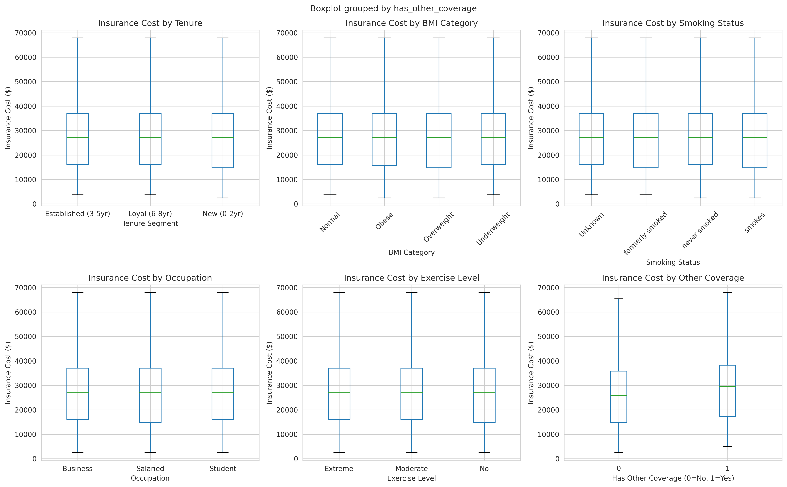
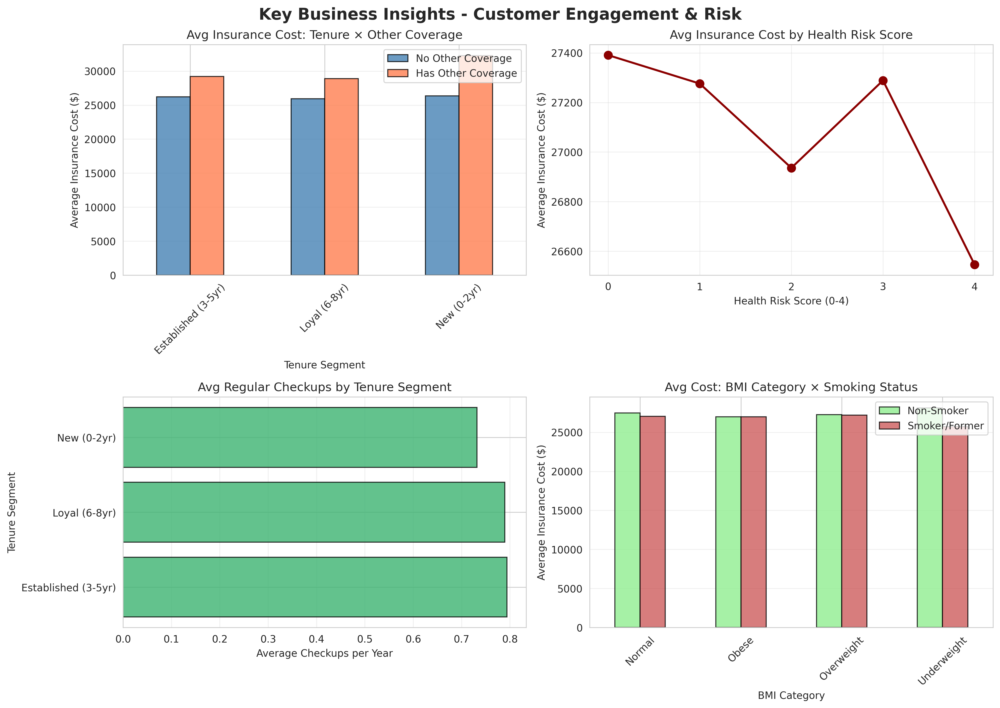

# Customer Lifetime Value Optimization Through Proactive Health Engagement
> A comprehensive data analysis portfolio project demonstrating CX analytics skills for insurance industry roles

[](https://www.python.org/)
[](LICENSE)
[](notebooks/phase1/)

---

## 🎯 Project Overview

This portfolio project analyzes **25,000 health insurance policyholders** to develop data-driven customer experience strategies focused on **retention** and **proactive health engagement**. The analysis addresses real-world CX challenges in the insurance industry: reducing churn, promoting preventive care, and optimizing customer lifetime value.

**Business Problem:**  
Insurance companies face high customer acquisition costs and increasing competition. By identifying retention drivers and promoting preventive health behaviors, companies can simultaneously reduce churn and lower long-term claim costs.

**Key Questions Addressed:**
- What factors drive customer retention and long-term value?
- How does health engagement correlate with customer loyalty?
- Which customer segments are at highest risk of churn?
- What is the potential ROI of wellness incentive programs?
- Where should we focus geographic expansion or retention efforts?

---

## 📊 Key Findings (Phase 1)

### 💡 Top Insights

1. **Competitive Threat Identified**  
   30.3% of customers have dual insurance coverage and pay **$3,167 more annually** (statistically significant, p<0.001). These price-sensitive customers represent high churn risk.

2. **Preventive Care Gap**  
   Average of only **0.77 annual checkups** across all customers, with new customers (0-2 years) at just **0.62/year**. Massive opportunity for health engagement programs.

3. **Pricing Inefficiency Discovery**  
   Health risk scores show **minimal correlation with insurance costs** (r=-0.007), suggesting potential for risk-based pricing optimization or cross-subsidization awareness.

4. **New Customer Activation Window**  
   30.3% of customer base are new (0-2 years) with lowest engagement rates—critical window to establish preventive care habits.

5. **High-Value Customer Profile**  
   Top 25% revenue customers (≥$37,020) aren't significantly unhealthier but have **37.4% dual coverage rate** vs 30.3% overall—vulnerable to competitive offers.

---

## 🛠️ Technologies & Skills Demonstrated

**Programming & Analysis:**
- Python (Pandas, NumPy, Scikit-learn)
- Statistical Testing (T-tests, ANOVA, Hypothesis Testing)
- Feature Engineering (11 new features created)
- Data Cleaning & Validation

**Visualization:**
- Matplotlib, Seaborn
- Statistical Charts (distributions, correlations, comparisons)
- Business Dashboards

**Business Analytics:**
- Customer Segmentation
- Cohort Analysis
- Risk Profiling
- Competitive Intelligence
- ROI Modeling (upcoming Phase 5)

---

## 📁 Project Structure

```
insurance-cx-portfolio/
│
├── README.md                          # This file
├── requirements.txt                   # Python dependencies
├── .gitignore                        # Git ignore rules
│
├── data/
│   ├── processed/                    # Cleaned datasets
│   └── README.md                     # Data documentation
│
├── notebooks/
│   └── phase1/                       # ✅ Phase 1: Complete
│       ├── 01_data_cleaning.py
│       ├── 02_exploratory_analysis.py
│       └── phase1_summary.md
│
├── outputs/
│   ├── figures/phase1/               # Visualizations
│   └── reports/                      # Analysis reports
│
├── docs/
│   ├── project_roadmap.md            # Full 6-phase plan
│   └── data_dictionary.md            # Feature descriptions
│
└── interactions/
    └── 2025-12-28_phase1_interaction.md
```

---

## 📈 Analysis Phases

| Phase | Focus Area | Status | Key Deliverables |
|-------|-----------|--------|------------------|
| **Phase 1** | Data Cleaning & EDA | ✅ **Complete** | Cleaned dataset, 4 visualization sets, statistical analysis |
| **Phase 2** | Segmentation & Retention | 🔄 In Progress | Churn model, CLV calculation, customer segments |
| **Phase 3** | Health Engagement Scoring | ⏳ Planned | Engagement score (0-100), customer personas |
| **Phase 4** | Geospatial & Temporal | ⏳ Planned | City-level heatmaps, engagement trends |
| **Phase 5** | A/B Test Simulation | ⏳ Planned | Wellness program ROI, scenario analysis |
| **Phase 6** | Dashboard & Strategy | ⏳ Planned | Interactive dashboard, strategic recommendations |

---

## 🚀 Quick Start

### Prerequisites
```bash
Python 3.9+
pip
```

### Installation
```bash
# Clone repository
git clone https://github.com/[your-username]/insurance-cx-portfolio.git
cd insurance-cx-portfolio

# Install dependencies
pip install -r requirements.txt

# Launch Jupyter
jupyter notebook
```

### Running Phase 1
```bash
cd notebooks/phase1
python 01_data_cleaning.py
python 02_exploratory_analysis.py
```

---

## 📊 Sample Visualizations

### Insurance Cost by Customer Segments


### Key Business Insights


*More visualizations available in `outputs/figures/`*

---

## 📖 Dataset

**Source:** Kaggle Health Insurance Dataset (mock data)  
**Size:** 25,000 policyholders  
**Features:** 24 original + 11 engineered = 35 total  

**Key Attributes:**
- Demographics (age, gender, occupation, location)
- Health Metrics (BMI, cholesterol, glucose, smoking status)
- Engagement (checkups, doctor visits, hospital admissions)
- Business Metrics (insurance cost, tenure, competitive coverage)

*Note: Data files are not included in repository due to size. Original dataset available on Kaggle.*

---

## 💼 Business Value for CX Roles

This project demonstrates:

✅ **Business-First Mindset** - Every analysis tied to actionable CX strategy  
✅ **Statistical Rigor** - Hypothesis testing, proper significance interpretation  
✅ **Industry Knowledge** - Insurance-specific metrics and challenges  
✅ **Communication Skills** - Executive summaries, visual storytelling  
✅ **End-to-End Workflow** - Raw data → insights → recommendations  
✅ **Reproducibility** - Documented code, clear methodology  

**Relevant for roles in:** Customer Analytics, CX Strategy, Retention Analytics, Health Insurance Analytics, Product Analytics

---

## 📫 Connect

**Portfolio Project By:** Rodion  
**LinkedIn:** [Your LinkedIn]  
**Email:** [Your Email]  
**Looking for:** CX Data Analyst roles in Insurance industry

---

## 📄 License

This project is licensed under the MIT License - see [LICENSE](LICENSE) file for details.

---

## 🙏 Acknowledgments

- Dataset source: Kaggle Health Insurance Dataset
- Inspired by real-world CX challenges in the insurance industry
- Built as a portfolio demonstration for CX Data Analyst roles

---

**Last Updated:** December 28, 2025  
**Current Phase:** Phase 1 Complete | Phase 2 In Progress
