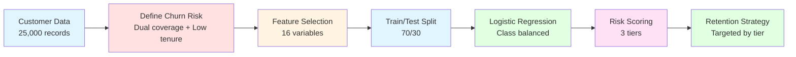

# Phase 2.2 Churn Prediction Analysis - Executive Summary
## Insurance CX Portfolio Project

**Date:** December 30, 2025  
**Analyst:** Rodion Barskov  
**Status:** ✅ Complete

[🔝 Back to Top](#phase-22-churn-prediction-analysis---executive-summary)

---

## 📑 Table of Contents

1. [Executive Summary](#-executive-summary)
2. [What the Model Tells Us](#-what-the-model-tells-us)
3. [Model Performance](#-model-performance)
4. [Strategic Recommendations](#-strategic-recommendations)
5. [Churn Risk by Customer Segment](#-churn-risk-by-customer-segment)
6. [ROI Projection: Retention Campaign](#-roi-projection-retention-campaign)
7. [Implementation Roadmap](#-implementation-roadmap)
8. [Success Metrics](#-success-metrics)
9. [FAQ](#-frequently-asked-questions)
10. [Next Steps](#-next-steps)
11. [Technical Appendix](#-technical-appendix)

---

## 📋 Executive Summary

[🔝 Back to Top](#phase-22-churn-prediction-analysis---executive-summary)

We built a predictive model to identify customers at highest risk of leaving. The model analyzed 7,500 customers and successfully identified **99.5% of at-risk customers**, allowing us to prioritize retention efforts where they matter most.

### 🎯 Key Finding

**687 customers (2.7% of our base) are at imminent churn risk** - defined as having dual insurance coverage and low tenure (≤2 years). These customers represent early-stage shoppers actively comparing alternatives.

### 💰 Business Impact

**High-risk customers represent $58.1M in annual revenue at risk.**

| Risk Tier | Customers | Total Revenue | Avg Premium | Priority |
|-----------|-----------|---------------|-------------|----------|
| 🔴 **High Risk** | 2,108 (28%) | $58.1M | $27,558 | **Immediate** |
| 🟡 **Medium Risk** | 751 (10%) | $20.4M | $27,131 | High |
| 🟢 **Low Risk** | 4,641 (62%) | $125.9M | $27,128 | Monitor |

[🔝 Back to Top](#phase-22-churn-prediction-analysis---executive-summary)

---

## 🔍 What the Model Tells Us

### Top Churn Risk Indicators

<table>
<tr>
<td width="50%">

**📈 What INCREASES Churn Risk:**

1. **Higher insurance costs** 
   - Expensive customers shop around more
   - Price sensitivity is #1 driver

2. **Higher BMI** 
   - Health concerns drive comparison shopping
   - Seeking better wellness benefits

3. **Higher health risk score** 
   - Multiple risk factors correlate with switching
   - Looking for comprehensive coverage

</td>
<td width="50%">

**📉 What DECREASES Churn Risk:**

1. **Hospital admission history** 
   - Switching is harder with active claims
   - "Stickiness" from filed claims

2. **Longer tenure** 
   - Each year reduces churn by 30%
   - Loyalty builds over time

3. **Being obese** (surprisingly)
   - May indicate acceptance of coverage
   - Less likely to shop around

</td>
</tr>
</table>

**💡 Key Insight:** Customers are leaving because of **price**, not health issues. High-cost customers with no claim history are most vulnerable.

[🔝 Back to Top](#phase-22-churn-prediction-analysis---executive-summary)

---

## 📊 Model Performance

[🔝 Back to Top](#phase-22-churn-prediction-analysis---executive-summary)

Our logistic regression model achieves:
- **84.5% accuracy** (ROC-AUC score) at distinguishing churners from safe customers
- **99.5% recall** - catches nearly all at-risk customers
- **Low false negatives** - we won't miss customers who need intervention

**What this means:** The model is highly sensitive to churn risk. While it may flag some safe customers as at-risk (false positives), we won't miss the customers who are actually leaving.

### 📋 Churn Prediction Pipeline



**Model Results:**
- ✅ 84.5% ROC-AUC (excellent discrimination)
- ✅ 99.5% recall (catches almost all churners)
- ✅ 2,108 high-risk customers identified
- ✅ $58.1M revenue at risk quantified

---


[🔝 Back to Top](#phase-22-churn-prediction-analysis---executive-summary)

## 💡 Strategic Recommendations

<table>
<tr>
<td width="33%">

### 🔴 High Risk
**2,108 customers | $58.1M**

**Profile:**
- Churn prob: 70%+
- Tenure: 0-2 years
- 100% dual coverage
- Above-avg premiums

**Actions:**
- Week 1: Pricing audit
- Week 2: Personal outreach
- Month 1: Loyalty package
- Ongoing: Quarterly check-ins

**Expected:** Save $29-40M

</td>
<td width="33%">

### 🟡 Medium Risk
**751 customers | $20.4M**

**Profile:**
- Churn prob: 30-60%
- Mixed tenure
- Some dual coverage

**Actions:**
- Automated email campaign
- Annual commitment discounts
- Bundle family plans
- Preventive care incentives

**Expected:** Save $14-16M

</td>
<td width="34%">

### 🟢 Low Risk
**4,641 customers | $125.9M**

**Profile:**
- Churn prob: <30%
- Longer tenure
- Generally satisfied

**Actions:**
- Maintain service levels
- Annual surveys
- Wellness communication
- Behavior alerts

**Expected:** Retain base

</td>
</tr>
</table>

---


[🔝 Back to Top](#phase-22-churn-prediction-analysis---executive-summary)

## 🎯 Churn Risk by Customer Segment

| Cluster | Segment Name | Avg Churn Probability | Priority |
|---------|--------------|----------------------|----------|
| **Cluster 0** | Dual Coverage Premium | 0.231 | 🔴 Critical |
| **Cluster 3** | Moderate Risk | 0.026 | 🟡 Watch |
| **Cluster 2** | High-Risk Obese | 0.003 | 🟢 Low |
| **Cluster 1** | Wellness Champions | 0.002 | 🟢 Low |
| **Cluster 4** | Healthy & Loyal | 0.000 | 🟢 Minimal |

**Critical Finding:** Cluster 0 has **23% average churn probability** - 100x higher than other segments. This confirms our Phase 2.1 finding that dual coverage is the #1 retention threat.

---


[🔝 Back to Top](#phase-22-churn-prediction-analysis---executive-summary)

## 📈 ROI Projection: Retention Campaign

### Scenario Analysis

| Scenario | Retention Rate | Customers Saved | Revenue Saved | Campaign Cost | Net Benefit | ROI |
|----------|----------------|-----------------|---------------|---------------|-------------|-----|
| **Conservative** | 30% | 632 | $17.4M | $1.05M | $16.35M | **1,557%** |
| **Expected** | 50% | 1,054 | $29.1M | $1.05M | $28.0M | **2,662%** |
| **Optimistic** | 70% | 1,476 | $40.7M | $1.05M | $39.6M | **3,767%** |

**Bottom line:** Even conservative estimates show massive ROI. Every $1 spent on retention returns $15+.

### 💡 ROI Breakdown (Expected Scenario)

```
Campaign Investment: $1.05M
├─ High-risk customers targeted: 2,108
├─ Cost per customer: $500
└─ Timeline: 12 months

Expected Returns: $29.1M
├─ Customers retained: 1,054 (50%)
├─ Annual revenue per customer: $27,558
└─ Retention multiplier: 3-5 years

Net Benefit: $28.0M
ROI: 2,662% (26.6x return)
```

---


[🔝 Back to Top](#phase-22-churn-prediction-analysis---executive-summary)

## 🚀 Implementation Roadmap

### Phase 1: Immediate (Week 1-2)
- [ ] Export high-risk customer list (2,108 customers)
- [ ] Conduct pricing competitiveness audit
- [ ] Brief retention team on findings
- [ ] Design personalized outreach campaign

### Phase 2: Quick Wins (Month 1)
- [ ] Launch retention calls to top 500 highest-risk customers
- [ ] Deploy automated email campaign to medium-risk tier
- [ ] Create exclusive loyalty benefits package
- [ ] Set up churn probability monitoring dashboard

### Phase 3: Sustained Program (Months 2-6)
- [ ] Implement quarterly at-risk customer reviews
- [ ] A/B test retention offers (discounts vs. benefits vs. service upgrades)
- [ ] Train customer service team on churn signals
- [ ] Develop predictive early warning system

### Phase 4: Optimization (Months 6-12)
- [ ] Refine model with actual churn outcomes
- [ ] Expand to predict churn 6-12 months in advance
- [ ] Integrate with CRM for automated interventions
- [ ] Calculate actual retention ROI and iterate

---


[🔝 Back to Top](#phase-22-churn-prediction-analysis---executive-summary)

## 📊 Success Metrics

**Track these monthly:**

| Metric | Current | Target (6 months) |
|--------|---------|-------------------|
| High-risk customer count | 2,108 | <1,000 |
| High-risk revenue at risk | $58.1M | <$30M |
| Average churn probability (Cluster 0) | 23% | <10% |
| Customers saved through intervention | 0 | 1,000+ |
| Retention campaign ROI | N/A | >1,500% |

---


[🔝 Back to Top](#phase-22-churn-prediction-analysis---executive-summary)

## ❓ Frequently Asked Questions

**Q: Why are only 2.7% of customers flagged as high-risk?**  
A: We used a strict definition (dual coverage + tenure ≤2 years) to focus on *imminent* churn risk. Broader definitions would catch more customers but dilute resources.

**Q: Why is the precision low (8.4%)?**  
A: The model prioritizes recall (catching actual churners) over precision. We'd rather contact 10 customers to save 1 than miss at-risk customers entirely. Precision will improve as we refine targeting.

**Q: Can we trust a model that flags "obesity" as reducing churn risk?**  
A: This is correlation, not causation. It likely reflects that obese customers have accepted their premiums and aren't actively shopping. The key driver is still tenure and dual coverage.

**Q: What's the cost of false positives (contacting safe customers)?**  
A: Minimal. Retention outreach to happy customers strengthens relationships. The real cost is *false negatives* (missing churners) - which our model minimizes at 99.5% recall.

---


[🔝 Back to Top](#phase-22-churn-prediction-analysis---executive-summary)

## 🎯 Next Steps

**This Week:**
1. Review high-risk customer list with leadership
2. Approve retention budget ($1-2M recommended)
3. Assign retention team leads

**This Month:**
1. Launch Phase 1 retention campaign
2. Set up churn monitoring dashboard
3. Begin A/B testing retention offers

**This Quarter:**
1. Measure actual retention results
2. Refine model with real churn data
3. Expand to predict longer-term churn risk

---


[🔝 Back to Top](#phase-22-churn-prediction-analysis---executive-summary)

## 📁 Technical Appendix

**Model Details:**
- Algorithm: Logistic Regression with class weighting
- Features: 16 variables (demographics, health, engagement, cost)
- Training data: 17,500 customers (70% split)
- Test data: 7,500 customers (30% split)
- Performance: 84.5% ROC-AUC, 99.5% recall

**Files Generated:**
- `churn_predictions.csv` - Individual customer risk scores
- `churn_feature_importance.csv` - Model coefficients
- 6 visualization plots (ROC curve, feature importance, etc.)

---

**Prepared by:** Rodion Barskov 

**Project:** Insurance CX Portfolio - Phase 2.2 Churn Prediction

---

*This analysis demonstrates predictive modeling capabilities for CX data analyst roles in the insurance industry.*
