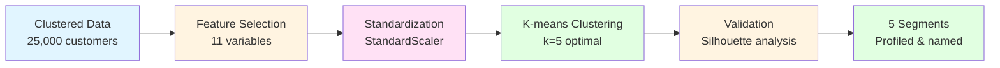

# Phase 2: Customer Segmentation - Analysis Summary
## Insurance CX Portfolio Project

**Date:** December 29, 2025 - ETD 
**Analyst:** Rodion Barskov 
**Status:** ✅ Complete

---

## 📑 Table of Contents

1. [Executive Summary for Stakeholders](#-executive-summary-for-stakeholders)
2. [Technical Segmentation Results](#-technical-segmentation-results)
3. [Customer Segments Identified](#-customer-segments-identified)
4. [Key Insights](#-key-insights)
5. [Segment Size & Distribution](#-segment-size--distribution)
6. [CX Strategy Recommendations](#-cx-strategy-recommendations)
7. [Deliverables](#-deliverables)
8. [Next Steps](#-next-steps)

---

## 📋 Executive Summary for Stakeholders

We analyzed 25,000 customers and discovered **5 distinct groups** with very different needs and risks. Here's what matters most:

### 🚨 **Cluster 0: "At-Risk Premium Customers" (21%, 5,354 customers)**

**The Problem:** Every single customer (100%) has insurance with a competitor too. They're our most expensive customers ($30,843/year) and have been with us longest (5.3 years), but they're shopping around.

**Impact:** We're at risk of losing **$165 million in annual revenue**. These loyal customers are comparing prices and may leave.

**Action Required:** Immediate retention campaign - exclusive benefits, loyalty rewards, price review.

---

### ⭐ **Cluster 1: "Wellness Champions" (13%, 3,249 customers)**

**The Success Story:** These customers get 3.3 checkups per year (8x more than average!). They're our lowest-cost customers ($20,650) despite moderate health risks.

**Impact:** Preventive care works! When customers engage with wellness programs, costs go down by **$10,000/year** compared to Cluster 0.

**Action Required:** Reward this behavior, use them as success stories, expand wellness programs to other groups.

---

### ⚠️ **Cluster 2: "High-Risk, Low-Engagement" (22%, 5,458 customers)**

**The Concern:** 91% are obese, 49% smoke, but only 0.4 checkups/year. Youngest group (44 years) but highest health risks.

**Impact:** Future healthcare crisis brewing. These customers will have expensive claims if we don't intervene now.

**Action Required:** Targeted health coaching, smoking cessation programs, incentivize preventive care.

---

### 📊 **Cluster 3: "Moderate Risk, Moderate Engagement" (16%, 4,094 customers)**

**The Profile:** Highest overall health risk (2.71/4.0), moderate engagement, 25% shopping with competitors.

**Impact:** Middle-of-the-road group that could go either way - improve or decline. Some competitive pressure.

**Action Required:** Risk education, wellness nudges, competitive pricing monitoring.

---

### 💚 **Cluster 4: "Healthy & Loyal" (27%, 6,845 customers - our largest!)**

**The Good News:** Healthiest group (only 26% obese, 18% smokers), almost zero competition (0% dual coverage), lowest health risk (0.89/4.0).

**The Puzzle:** They're paying average prices ($27,622) despite being low-risk, and barely using preventive care (0.3 checkups/year).

**Action Required:** Keep them happy, offer wellness perks to maintain health, consider loyalty pricing.

---

### 💡 **Strategic Priorities**

| Priority | Segment | Action | Revenue Impact |
|----------|---------|--------|----------------|
| **🔴 Urgent** | Cluster 0 | Retention campaign | Save $165M |
| **🟡 High** | Cluster 2 | Health intervention | Prevent future claims |
| **🟢 Opportunity** | Cluster 1 | Scale wellness success | Reduce costs across base |
| **🟢 Maintain** | Cluster 4 | Keep satisfied | Protect $189M revenue |

**Bottom Line:** This segmentation allows us to tailor communications and programs instead of treating all 25,000 customers the same way. The data shows clear patterns - preventive care works (Cluster 1), dual coverage signals churn risk (Cluster 0), and health intervention is urgent (Cluster 2).

[🔝 Back to Top](#phase-2-customer-segmentation---analysis-summary)

---

## 📊 Technical Segmentation Results

### Methodology
- **Algorithm:** K-means clustering
- **Features:** 11 variables (demographics, health, engagement, business)
- **Optimal k:** 5 clusters (determined by silhouette analysis)
- **Standardization:** StandardScaler applied to all features

### 📋 Segmentation Process

[🔝 Back to Top](#phase-2-customer-segmentation---analysis-summary)

---

## 👥 Customer Segments Identified

### **Cluster 0: "Dual Coverage Premium" (21.4%, n=5,354)**

<table>
<tr>
<td width="50%">

**📊 Profile**
- Age: 45.1 years (mature)
- Tenure: 5.3 years (most loyal)
- Health Risk: 1.44/4.0 (moderate-low)
- **100% have dual coverage** ⚠️
- Cost: **$30,843** (highest)
- Checkups: 0.41/year (below avg)

**⚡ Key Characteristics**
- Every customer has competing insurance
- Longest tenure but highest churn risk
- Paying premium prices
- Moderate health (29% smokers, 49% obese)

</td>
<td width="50%">

**🎯 CX Strategy**
- **Urgent retention focus**
- Exclusive benefits program
- Personalized account management
- Price competitiveness analysis
- Loyalty rewards

**😟 Pain Points**
- Feel overcharged vs competitors
- Shopping for better rates
- Need value justification

**💰 Revenue Impact:** $165M at risk

</td>
</tr>
</table>

---

### **Cluster 1: "Engaged Wellness Seekers" (13.0%, n=3,249)**

<table>
<tr>
<td width="50%">

**📊 Profile**
- Age: 46.0 years
- Tenure: 4.3 years
- Health Risk: 1.61/4.0 (moderate)
- Dual coverage: 30% (moderate risk)
- Cost: **$20,650** (lowest)
- Checkups: **3.28/year** (8x avg!) ⭐

**⚡ Key Characteristics**
- Highest preventive care engagement
- Proactive about health
- Lower costs = good management
- 32% smokers, 52% obese (managing it)

</td>
<td width="50%">

**🎯 CX Strategy**
- **Reward & amplify** engagement
- Wellness champions/ambassadors
- Premium discounts for engagement
- Health coaching upsell
- Testimonials & referrals

**😟 Pain Points**
- Want recognition for healthy behaviors
- May seek better wellness benefits

**💰 Revenue Impact:** $67M (protect + expand)

</td>
</tr>
</table>

---

### **Cluster 2: "High-Risk Obese" (21.8%, n=5,458)**

<table>
<tr>
<td width="50%">

**📊 Profile**
- Age: 43.7 years (youngest)
- Tenure: 3.5 years
- Health Risk: **2.27/4.0** (2nd highest)
- **90.6% obese** (BMI 37.4)
- **49% smokers** (highest)
- Dual coverage: 4.4% (low flight risk)
- Cost: $26,498
- Checkups: 0.38/year (very low)

**⚡ Key Characteristics**
- Youngest but highest risk profile
- Severely obese population
- High smoking rate
- Very low engagement
- Not shopping around

</td>
<td width="50%">

**🎯 CX Strategy**
- **Intensive health intervention**
- Obesity/smoking cessation programs
- Incentivized preventive screenings
- Disease management enrollment
- Higher touch support

**😟 Pain Points**
- Health challenges creating barriers
- Not prioritizing preventive care
- Future claims costs substantial

**💰 Revenue Impact:** $145M (intervention needed)

</td>
</tr>
</table>

---

### **Cluster 3: "Moderate Risk, Moderate Engagement" (16.4%, n=4,094)**

<table>
<tr>
<td width="50%">

**📊 Profile**
- Age: 44.7 years
- Tenure: 3.9 years
- Health Risk: **2.71/4.0** (highest)
- BMI: 32.2 (obese)
- 41% smokers
- Dual coverage: 24.6%
- Cost: $27,543
- Checkups: 0.51/year (low but better)

**⚡ Key Characteristics**
- Highest overall health risk score
- Moderate obesity and smoking
- Some preventive care engagement
- Quarter have dual coverage

</td>
<td width="50%">

**🎯 CX Strategy**
- **Risk stratification** - identify high-priority
- Chronic condition management
- Moderate retention risk monitoring
- Smoking cessation incentives
- Wellness nudges for checkups

**😟 Pain Points**
- Multiple health risk factors
- May not appreciate risk level
- Some price sensitivity

**💰 Revenue Impact:** $113M (stabilize + improve)

</td>
</tr>
</table>

---

### **Cluster 4: "Low-Risk Healthy Base" (27.4%, n=6,845)**

<table>
<tr>
<td width="50%">

**📊 Profile**
- Age: 45.4 years
- Tenure: 3.6 years
- Health Risk: **0.89/4.0** (lowest!)
- BMI: 27.2 (near-normal)
- Only 18% smokers (lowest)
- Only 26% obese (lowest)
- Dual coverage: 0.09% (virtually none)
- Cost: $27,622
- Checkups: 0.34/year (low)

**⚡ Key Characteristics**
- Largest segment (27%)
- Healthiest customer base
- Very low competitive risk
- Low engagement despite health
- Paying average premiums despite low risk

</td>
<td width="50%">

**🎯 CX Strategy**
- **Maintain & prevent migration**
- Wellness education (staying healthy)
- Reward low-risk status
- Fitness/activity programs
- Cross-sell (family plans)

**😟 Pain Points**
- May not see value (rarely use)
- Low engagement = potential disengagement
- Risk of switching for better price

**💰 Revenue Impact:** $189M (protect this base)

</td>
</td>
</tr>
</table>

[🔝 Back to Top](#phase-2-customer-segmentation---analysis-summary)

---

## 🎯 Key Insights

### Critical Findings:

1. **Cluster 0 is a ticking time bomb** - 100% dual coverage in highest-paying segment = imminent churn risk of $165M annual revenue

2. **Cluster 1 proves wellness works** - 3.28 checkups/year correlates with lowest costs ($20,650 vs $30,843)

3. **Cluster 2 needs urgent intervention** - 90% obese, 49% smokers, almost no preventive care = future claims crisis

4. **Cluster 4 is undervalued** - Healthiest customers paying average premiums = pricing inefficiency or potential discount opportunity

5. **Engagement gap across all segments** - Except Cluster 1, all have <1 checkup/year

### Business Priorities (by urgency):

1. **Immediate:** Retain Cluster 0 (100% dual coverage, $165M at risk)
2. **High:** Intervene with Cluster 2 (health crisis prevention)
3. **Medium:** Grow Cluster 1 behaviors across other segments
4. **Medium:** Address Cluster 3 health risks before escalation
5. **Low:** Maintain Cluster 4 satisfaction

---

## 📈 Segment Size & Distribution

| Cluster | Segment Name | Size | % of Base | Avg Cost | Total Revenue |
|---------|--------------|------|-----------|----------|---------------|
| 0 | Dual Coverage Premium | 5,354 | 21.4% | $30,843 | $165M |
| 1 | Engaged Wellness Seekers | 3,249 | 13.0% | $20,650 | $67M |
| 2 | High-Risk Obese | 5,458 | 21.8% | $26,498 | $145M |
| 3 | Moderate Risk | 4,094 | 16.4% | $27,543 | $113M |
| 4 | Low-Risk Healthy Base | 6,845 | 27.4% | $27,622 | $189M |
| **Total** | | **25,000** | **100%** | **$27,147** | **$679M** |

[🔝 Back to Top](#phase-2-customer-segmentation---analysis-summary)

---

## 💡 CX Strategy Recommendations

### 1. Retention Crisis Management (Cluster 0)
- Immediate competitive pricing review
- VIP account management program
- Exclusive benefits package
- Loyalty bonuses for renewal
- **Goal:** Reduce dual coverage from 100% to <50% in 12 months

### 2. Scale Wellness Success (Cluster 1 → All)
- Publicize Cluster 1 as success stories
- Replicate wellness program elements
- Incentivize checkups across all segments
- **Goal:** Increase average checkups from 0.77 to 1.5/year

### 3. High-Risk Intervention (Cluster 2)
- Mandatory health coaching for BMI >35
- Smoking cessation program with premium discounts
- Preventive care incentives ($50/checkup)
- **Goal:** Reduce obesity rate from 90% to 75%

### 4. Segment-Specific Communication
- Cluster 0: Value proposition, competitive benefits
- Cluster 1: Recognition, rewards, community
- Cluster 2: Health support, empathy, resources
- Cluster 3: Education on risk, prevention importance
- Cluster 4: Wellness maintenance, family benefits

[🔝 Back to Top](#phase-2-customer-segmentation---analysis-summary)

---

## 📁 Deliverables

**Generated Files:**
- `insurance_data_clustered.csv` - Dataset with cluster assignments
- `cluster_profile_summary.csv` - Detailed segment metrics
- `01_optimal_clusters.png` - Elbow and silhouette analysis
- `02_clusters_pca.png` - PCA visualization of segments
- `03_cluster_heatmap.png` - Profile comparison heatmap
- `04_cluster_radar.png` - Radar charts for each segment
- `05_cost_by_cluster.png` - Cost distribution boxplots

**Jupyter Notebook:**
- `01_customer_segmentation.ipynb` - Full analysis with code and commentary

---

## 🔄 Next Steps

[🔝 Back to Top](#phase-2-customer-segmentation---analysis-summary)

**Phase 2.2 - Churn Prediction:**
- Build model to predict churn risk within Cluster 0
- Identify early warning signals across all segments
- Score customers by retention priority

**Phase 2.3 - CLV Analysis:**
- Calculate lifetime value by segment
- Model CLV impact of wellness interventions
- ROI analysis for retention programs

**Phase 3 - Health Engagement Scoring:**
- Create detailed 0-100 engagement score
- Map engagement → cost relationship
- Design tiered wellness program

---

**Status:** ✅ Segmentation Complete  
**Next:** Phase 2.2 Churn Prediction Model

*Analysis Date: December 29, 2025*
